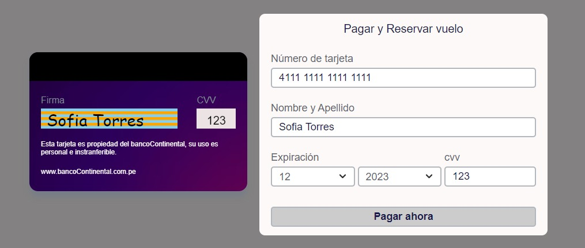

# Tarjeta de crédito válida

## Preámbulo

El [algoritmo de Luhn](https://es.wikipedia.org/wiki/Algoritmo_de_Luhn), también llamado algoritmo de módulo 10, es un método de suma de verificación,se utiliza para validar números de identificación; tales como el IMEI de loscelulares, tarjetas de crédito, etc.

Este algoritmo es simple. Obtenemos la reversa del número a verificar (que solamente contiene dígitos [0-9]); a todos los números que ocupan una posición par se les debe multiplicar por dos, si este número es mayor o igual a 10, debemos sumar los dígitos del resultado; el número a verificar será válido si la suma de sus dígitos finales es un múltiplo de 10.

## Resumen del proyecto

### Validación de Tarjetas de Crédito en un Escenario de Agencia de Viajes

La aplicación "Validador de Tarjeta de Crédito" permite a los usuarios ingresar el número de su tarjeta de crédito en el campo provisto. El validador aplica el algoritmo de Luhn para verificar la validez de la tarjeta. Si es válida, se muestra un mensaje de aprobación y se ocultan todos los dígitos, excepto los últimos cuatro. Además, se muestra el logotipo de Visa o MasterCard según la franquicia de la tarjeta.

La interfaz de la aplicación recrea el escenario de una agencia de viajes, brindando a los usuarios una experiencia visual atractiva y realista. 

## Interfaz de Usuario

### Pantalla de Inicio

La pantalla de inicio es el primer lugar donde los usuarios interactúan con nuestra aplicación. Aquí pueden ingresar el número de su tarjeta de crédito para su validación.

### Pantalla de Volteo y Firma

Hemos mejorado la experiencia de usuario en la pantalla de validación de tarjeta de crédito con algunos efectos especiales:

- **Efecto de Volteo**: Ahora, cuando haces clic en la tarjeta, se activa un efecto de volteo para mostrar la parte trasera de la tarjeta. Esto permite ver el CVV y la firma del titular.

- **Firma del Titular**: En la parte trasera de la tarjeta, el nombre del titular se convierte en una firma personalizada. Hemos utilizado una fuente manuscrita para darle un toque auténtico.

### Validación Exitosa
git add
Cuando el usuario ingresa un número de tarjeta de crédito válido, la aplicación muestra un mensaje de validación exitosa y oculta todos los dígitos de la tarjeta, excepto los últimos cuatro. 

- Si el número de tarjeta de crédito comienza con "4", se muestra el logotipo de Visa.
- Si el número de tarjeta de crédito comienza con "5", se muestra el logotipo de MasterCard.
- Si el usuario ingresa un número de tarjeta de crédito no válido, la aplicación muestra un mensaje de validación fallida para informar al usuario que la tarjeta no es válida.

## Objetivos Generales

Este proyecto tiene los siguientes objetivos:

- Aplicar conceptos de JavaScript, HTML y CSS.
- Construir una interfaz de usuario interactiva.
- Implementar pruebas unitarias para garantizar la funcionalidad del validador.
- Utilizar control de versiones con Git y alojar el proyecto en GitHub.
- Desplegar la interfaz en línea usando GitHub Pages.

---

[Enlace a la interfaz de usuario](https://sofia-torres-v.github.io/Card-validation/src/index.html)

---

